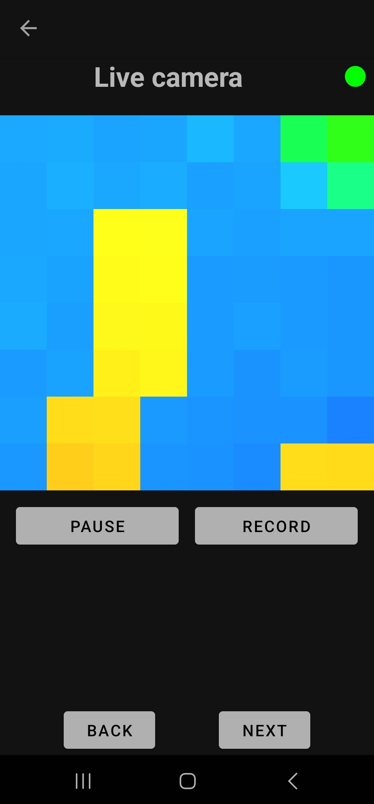

# btToF

> The programming *javadoc* documentation is inside the `docs/` folder. Just run `index.html`.

> Java server app is inside the `src/` folder and the mobile app is inside `RPBT/`.

The ToF camera is a device that uses Time-of-Flight technology to measure distance. Camera emits infrared light that bounces off objects and back to the sensor. Based on time, the light takes to travel back and forth, the camera calculates the distance to each object, which enabling accurate detection of movement and shapes in space.

There are already similar projects that have focused on displaying footage from ToF cameras, for example [ArduCAM](https://github.com/ArduCAM/Arducam_tof_camera), or [espros](https://github.com/espros/epc-tofcam-toolkit). However, no implementation is yet in Java and no implementation provides transmission to a mobile phone via Bluetooth. 

This project therefore focuses on the development of a mobile application on Android that allows the user to communicate via Bluetooth or via LAN to remotely record and play back recorded content from camera.

## Table of Contents 
- [Used technologies](#techno)
- [Installation](#installation)
   * [Download jar file from releases](#downjar)
   * [Build from source](#buildsource)
- [Usage](#usage)
   * [Bluetooth Java server](#server)
   * [Mobile app](#mobile)
- [Gallery](#gallery)

<a name="techno"></a>
## Used technologies

The project uses *Nucleo board STM32F401* devices together with *VL53L5 ToF* camera and *Raspberry Pi 5*.

For creating the Android application [Android Studio Flamingo](https://developer.android.com/studio/releases/past-releases/as-flamingo-release-notes) and [IntelliJ IDEA](https://www.jetbrains.com/idea/) was used with Java 21 language.

Used libraries: 
- [JSON In Java](https://mvnrepository.com/artifact/org.json/json) - library to make it easier to work with `.json` files
- [JSerialComm](https://mvnrepository.com/artifact/com.fazecast/jSerialComm) - a library that simplifies working with ports (devices connected via USB)
- [BlueCove](https://mvnrepository.com/artifact/io.ultreia/bluecove) - a library for Bluetooth communication

<a name="installation"></a>
## Installation

<a name="downjar"></a>
### Download jar file from releases

Download the latest [release](https://gitlab.mff.cuni.cz/teaching/nprg045/hnetynka/2024-velicka/-/releases/1.0) of the mobile app ([`.app`](https://gitlab.mff.cuni.cz/-/project/14769/uploads/ba3a8ea0a938573d7a6e67517bb676d0/btToF.apk)) and [`.tar.gz`](https://gitlab.mff.cuni.cz/-/project/14769/uploads/b894906eecb50a31942248f52873adef/btTof_v1.0.tar.gz) file.

```bash
tar -xvzf btTof_v1.0.tar.gz
cd btTof_v1.0

java -jar ima-bluetooth-TOF-1.0.jar 
```

<a name="buildsource"></a>
### Build from source
```bash
git clone https://gitlab.mff.cuni.cz/teaching/nprg045/hnetynka/2024-velicka.git
cd "2024-velicka"

mvn package

# run app
java -jar target/ima-bluetooth-TOF-1.0.jar 
```

<a name="usage"></a>
## Usage

<a name="server"></a>
### Bluetooth Java server

Run the `.jar` package using `java -jar`.

- When it starts you will see a message asking if you want to start a LAN or Bluetooth server. 
- Enter `bt` or `lan` depending on what you want.
- That's all. Now connect from the mobile app.

<a name="mobile"></a>
### Mobile app

1. Just start it.
2. Select the appropriate config and save it.
3. Click `Back` and connect to Bluetooth/ LAN.
4. Click `Back` and you can start streaming/recording.

How to connect to Bluetooth/ LAN:
- Bluetooth connection:
    - First pair with the Bluetooth Server (normally from the phone settings)
    - Then click on `Scan devices`. The `Paired devices` box should show the current connected device
    - Click on `Connect`
- LAN connection:
    - Enter the IP address and LAN port of the server
    - Click on `Connect`

<a name="gallery"></a>
## Gallery

|              Config               |               Live camera                |              Video player               |                 Bluetooth settings                  |
| ------------------------------- | ----------------------------------------- | --------------------------------------- | --------------------------------------------------- |
|  |  |  |  |


## Errors

In case of:
> `javax.bluetooth.ServiceRegistrationException: Can not open SDP session. [13] Operation denied`

Run `sudo chmod 777 /var/run/sdp`