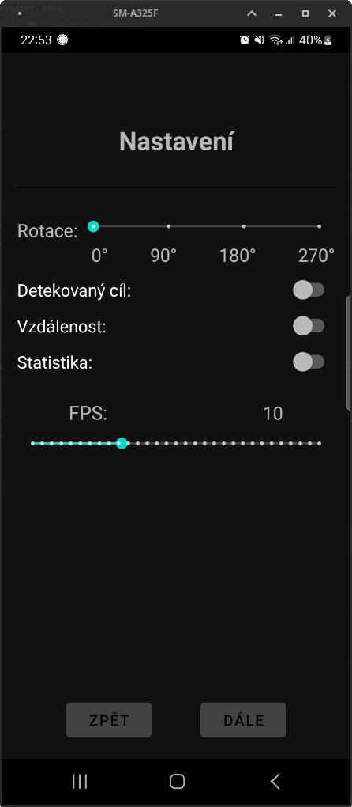
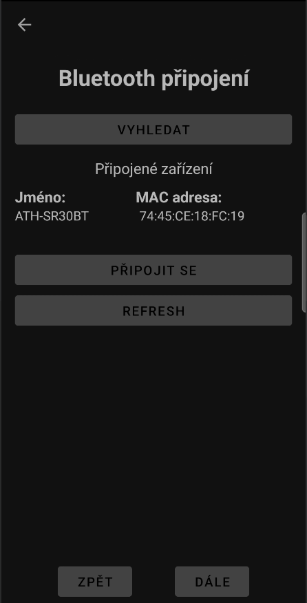
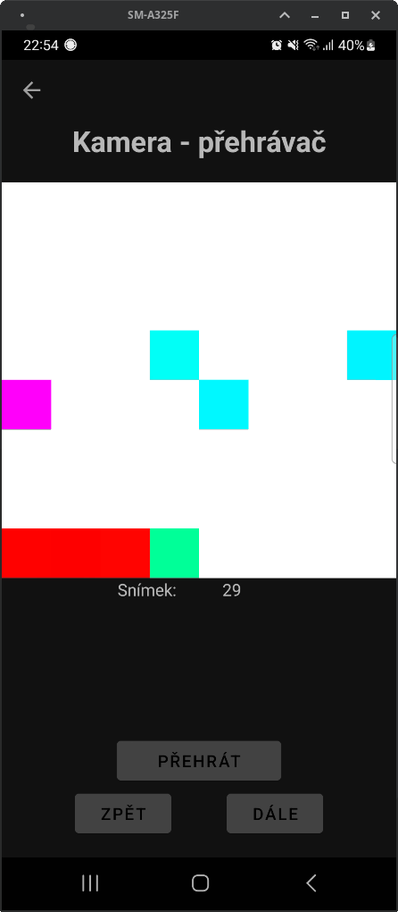

# Specifikace

Cílem projektu je vytvořit mobilní aplikaci komunikující přes bluetooth s Raspberry Pi, na kterém běží ToF kamera.
Hlavními funkcemi bude:
- připojení přes bluetooth mezi RaspberryPi - mobilní telefon
- přehrání video záznamu z JSON souboru
- nahrát video a uložit ho do JSON souboru
- drobnosti navíc v přehrávači - změna FPS, apod.

V projektu byla využita *Nucleo board STM32F401* spolu s *VL53L5 ToF* kamerou.
Pro tvorbu Android aplikace je využito [Android Studio Flamingo](https://developer.android.com/studio/releases/past-releases/as-flamingo-release-notes) a obecně programování je v Javě 21.

Náhled uživatelského rozhraní:

| Nastavení | Bluetooth | Přehrávač | Video aplikace |
| --- | --- | --- | --- |
|  |  |  |  |
